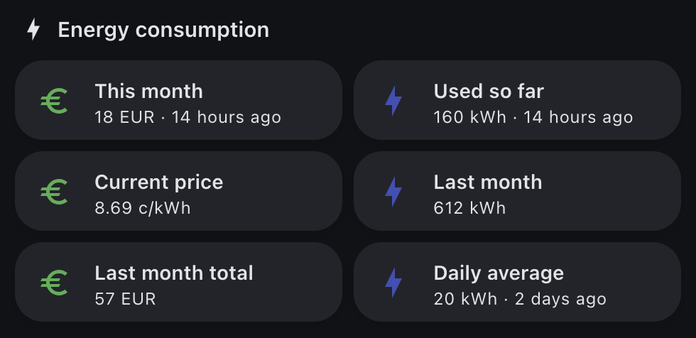

[](https://github.com/hacs/integration)

# Oma Helen Home Assistant integration

[Home Assistant](https://www.home-assistant.io/) integration for [Oma Helen Python module](https://github.com/carohauta/oma-helen-cli). Periodically fetch your electricity consumption and estimated costs.



The integration works for the following contract types:
- Exchange Electricity (=pörssisähkö) https://www.helen.fi/en/electricity/electricity-products-and-prices/exchange-electricity
- Smart Electricity Guarantee https://www.helen.fi/en/electricity/electricity-products-and-prices/smart-electricity-guarantee
- Market Price Electricity https://www.helen.fi/en/electricity/electricity-products-and-prices/marketpriceelectricity
- Fixed Price Electricity https://www.helen.fi/en/electricity/electricity-products-and-prices/fixed-price-basic-electricity

### How to install

Requires HA Core version 2022.7.0 or newer

Install as [HACS custom repository](https://hacs.xyz/docs/faq/custom_repositories)
OR
Copy the `helen_energy/` folder into your HA `config/custom_components/`

#### Step-by-step manual installation

Login to your HA with SSH

1. Go to the HA configuration root folder, which is the same folder where your `configuration.yaml` is located. Run the following commands

💡 Tip: step #1 can be skipped if you installed the integration as HACS custom repository

```shell
cd custom_components # create this folder if it does not exists
git clone https://github.com/carohauta/oma-helen-ha-integration omahelen
mv omahelen/custom_components/helen_energy/ .
```
2. Add your Oma Helen credentials to the `secrets.yaml`
```yaml
oma_helen_username: <USERNAME>
oma_helen_password: <PASSWORD>
```
3. Add a new sensor with `helen_energy` platform to the `configuration.yaml`.
```yaml
sensor:
  - platform: helen_energy
    vat: 0.24 # 24%
    contract_type: FIXED
    default_base_price: 3.0 # optional value in EUR
    default_unit_price: 10.0 # optional value in c/kwh
    include_transfer_costs: True # optional boolean (True/False)
    delivery_site_id: 643001234567891234 # optional delivery site id (GSRN) if you have multiple contracts with Helen
    username: !secret oma_helen_username
    password: !secret oma_helen_password
```
- `vat` is the current electricity tax percentage in a decimal format
- `contract_type` can have one of the following values
  - EXCHANGE
  - SMART_GUARANTEE
  - MARKET
  - FIXED
- `default_base_price` optional value if you want to set a fixed base price for your contract – if not set, the base price will be automatically fetched
- `default_unit_price` optional value if you want to set a fixed unit price for your energy – if not set, the unit price will be automatically fetched. Note that the `default_unit_price` does not have an effect with the `EXCHANGE` contract type.
- `include_transfer_costs` optional boolean for fetching energy transfer costs for the on-going month - shows `0.0` if Helen is not your transfer company
- `delivery_site_id` optional value for selecting a specific delivery site – if not set, will use the delivery site of the latest contract. Check your wanted delivery site id from Oma Helen. It is usually an 18 digit long GSRN number (64300xxxxxxxxxxxxx). Note that the old 7 digit delivery site id will also work. In case the entered number is not valid for some reason, the integration will log all valid options in the HA Core log.

4. Restart HA

### How to interpret the entitites

Depending on your contract type you will see one of the following new entities:
- sensor.helen_exchange_electricity
- sensor.helen_smart_guarantee
- sensor.helen_market_price_electricity
- sensor.helen_fixed_price_electricity

The `state` of each entity is the total energy cost of the on-going month. In the state attributes you may find some other useful information like last month's and current month's energy consumptions, daily average consumption, usage impact on price, current electricity price (in fixed contracts) etc. Use template sensors to display the attributes.

If you have chosen to include the transfer costs you will also see the following entity:
- sensor.helen_transfer_costs

The `state` of the entity shows the total energy transfer costs for the on-going month. The price is presented in EUR and it includes the base price of your transfer contract. If Helen is not your energy transfer company, this entity does not serve a purpose and shows a default value of `0.0`.

The integration also supports HA energy dashboard via the following entity:
- sensor.helen_monthly_consumption

The `state` of the sensor is the total energy consumption (in kWh) of the on-going month.

### Examples

Configuration examples for each contract type including template sensors and lovelace card examples.

#### Exchange Electricity

Template sensors:
```yml
sensor:
  - platform: helen_energy
    username: !secret oma_helen_username
    password: !secret oma_helen_password
    vat: 0.1
    contract_type: EXCHANGE
  - platform: template
    sensors:
      helen_exchange_energy_consumption:
        friendly_name: "This month energy consumption"
        unit_of_measurement: "kWh"
        icon_template: mdi:lightning-bolt
        device_class: "energy"
        value_template: >
          {{ 0 if state_attr('sensor.helen_exchange_electricity', 'current_month_consumption') == None else state_attr('sensor.helen_exchange_electricity', 'current_month_consumption') | round() }}
      helen_exchange_energy_consumption_last_month:
        friendly_name: "Last month energy consumption"
        unit_of_measurement: "kWh"
        icon_template: mdi:lightning-bolt
        value_template: >
          {{ 0 if state_attr('sensor.helen_exchange_electricity', 'last_month_consumption') == None else state_attr('sensor.helen_exchange_electricity', 'last_month_consumption')| round() }}
      helen_exchange_energy_last_month_total_cost:
        friendly_name: "Last month energy cost"
        unit_of_measurement: "e"
        icon_template: mdi:currency-eur
        value_template: >
            {{ 0 if state_attr('sensor.helen_exchange_electricity', 'last_month_total_cost') == None else state_attr('sensor.helen_exchange_electricity', 'last_month_total_cost') | round() }}
      helen_exchange_energy_daily_average_consumption:
        friendly_name: "Daily average consumption"
        unit_of_measurement: "kWh"
        icon_template: mdi:lightning-bolt
        value_template: >
          {{ 0 if state_attr('sensor.helen_exchange_electricity', 'daily_average_consumption') == None else state_attr('sensor.helen_exchange_electricity', 'daily_average_consumption') | round() }}

```

Lovelace Card:
```yml
type: vertical-stack
cards:
  - type: markdown
    content: ' # Energy consumption'
  - type: horizontal-stack
    cards:
      - type: entity
        entity: sensor.helen_exchange_electricity
        name: This month est.
        unit: EUR
        icon: None
      - type: entity
        entity: sensor.helen_exchange_energy_consumption
        name: Used so far...
  - type: horizontal-stack
    cards:
      - type: entity
        entity: sensor.helen_exchange_energy_last_month_total_cost
        unit: EUR
        icon: None
        name: Last month
      - type: entity
        entity: sensor.helen_exchange_energy_consumption_last_month
        name: Last month
  - type: horizontal-stack
    cards:
      - type: markdown
        content: ' '
      - type: entity
        entity: sensor.helen_exchange_energy_daily_average_consumption
        name: Daily average

```

#### Smart Guarantee

Template sensors:
```yml
sensor:
  - platform: helen_energy
    username: !secret oma_helen_username
    password: !secret oma_helen_password
    vat: 0.1
    contract_type: SMART_GUARANTEE
  - platform: template
    sensors:
      helen_smart_guarantee_energy_consumption:
        friendly_name: "This month energy consumption"
        unit_of_measurement: "kWh"
        device_class: "energy"
        icon_template: mdi:lightning-bolt
        value_template: >
          {{ 0 if state_attr('sensor.helen_smart_guarantee', 'current_month_consumption') == None else state_attr('sensor.helen_smart_guarantee', 'current_month_consumption') | round() }}
      helen_smart_guarantee_energy_consumption_last_month:
        friendly_name: "Last month energy consumption"
        unit_of_measurement: "kWh"
        icon_template: mdi:lightning-bolt
        value_template: >
          {{ 0 if state_attr('sensor.helen_smart_guarantee', 'last_month_consumption') == None else state_attr('sensor.helen_smart_guarantee', 'last_month_consumption') | round() }}
      helen_smart_guarantee_energy_price_current_month:
        friendly_name: "This month energy price"
        unit_of_measurement: "c/kWh"
        icon_template: mdi:currency-eur
        value_template: >
          {{ 0 if state_attr('sensor.helen_smart_guarantee', 'current_month_price_with_impact') == None else (state_attr('sensor.helen_smart_guarantee', 'current_month_price_with_impact') * 100) | round(2) }}
      helen_smart_guarantee_energy_daily_average_consumption:
        friendly_name: "Daily average consumption"
        unit_of_measurement: "kWh"
        icon_template: mdi:lightning-bolt
        value_template: >
          {{ 0 if state_attr('sensor.helen_smart_guarantee', 'daily_average_consumption') == None else state_attr('sensor.helen_smart_guarantee', 'daily_average_consumption')| round() }}

```

Lovelace Card:
```yml
type: vertical-stack
cards:
  - type: markdown
    content: ' # Energy consumption'
  - type: horizontal-stack
    cards:
      - type: entity
        entity: sensor.helen_smart_guarantee
        name: This month est.
        unit: EUR
        icon: None
      - type: entity
        entity: sensor.helen_smart_guarantee_energy_consumption
        name: Used so far...
  - type: horizontal-stack
    cards:
      - type: entity
        entity: sensor.helen_smart_guarantee_energy_price_current_month
        icon: None
        name: Current price
      - type: entity
        entity: sensor.helen_smart_guarantee_energy_consumption_last_month
        name: Last month
  - type: horizontal-stack
    cards:
      - type: markdown
        content: ' '
      - type: entity
        entity: sensor.helen_smart_guarantee_energy_daily_average_consumption
        name: Daily average

```

#### Market Price

Template sensors:
```yml
sensor:
  - platform: helen_energy
    username: !secret oma_helen_username
    password: !secret oma_helen_password
    vat: 0.1
    contract_type: MARKET
  - platform: template
    sensors:
      helen_market_price_energy_consumption:
        friendly_name: "This month energy consumption"
        unit_of_measurement: "kWh"
        device_class: "energy"
        icon_template: mdi:lightning-bolt
        value_template: >
            {{ 0 if state_attr('sensor.helen_market_price_electricity', 'current_month_consumption') == None else state_attr('sensor.helen_market_price_electricity', 'current_month_consumption') | round() }}
      helen_market_price_energy_consumption_last_month:
        friendly_name: "Last month energy consumption"
        unit_of_measurement: "kWh"
        icon_template: mdi:lightning-bolt
        value_template: >
            {{ 0 if state_attr('sensor.helen_market_price_electricity', 'last_month_consumption') == None else state_attr('sensor.helen_market_price_electricity', 'last_month_consumption') | round() }}
      helen_market_price_energy_last_month_total_cost:
        friendly_name: "Last month energy cost"
        unit_of_measurement: "e"
        icon_template: mdi:currency-eur
        value_template: >
            {{ 0 if state_attr('sensor.helen_market_price_electricity', 'last_month_total_cost') == None else state_attr('sensor.helen_market_price_electricity', 'last_month_total_cost') | round() }}
      helen_market_price_energy_daily_average_consumption:
        friendly_name: "Daily average consumption"
        unit_of_measurement: "kWh"
        icon_template: mdi:lightning-bolt
        value_template: >
            {{ 0 if state_attr('sensor.helen_market_price_electricity', 'daily_average_consumption') == None else state_attr('sensor.helen_market_price_electricity', 'daily_average_consumption') | round() }}
      helen_market_price_energy_price_current_month:
        friendly_name: "This month energy price"
        unit_of_measurement: "c/kWh"
        icon_template: mdi:currency-eur
        value_template: >
            {{ 0 if state_attr('sensor.helen_market_price_electricity', 'price_current_month') == None else state_attr('sensor.helen_market_price_electricity', 'price_current_month') | round(2) }}
            
```

Lovelace Card:
```yml
type: vertical-stack
cards:
  - type: markdown
    content: ' # Energy consumption'
  - type: horizontal-stack
    cards:
      - type: entity
        entity: sensor.helen_market_price_electricity
        name: This month est.
        unit: EUR
        icon: None
      - type: entity
        entity: sensor.helen_market_price_energy_consumption
        name: Used so far...
  - type: horizontal-stack
    cards:
      - type: entity
        entity: sensor.helen_market_price_energy_last_month_total_cost
        unit: EUR
        icon: None
        name: Last month
      - type: entity
        entity: sensor.helen_market_price_energy_consumption_last_month
        name: Last month
  - type: horizontal-stack
    cards:
      - type: entity
        entity: sensor.helen_market_price_energy_price_current_month
        icon: None
        name: Current price
      - type: entity
        entity: sensor.helen_market_price_energy_daily_average_consumption
        name: Daily average
        
```

#### Fixed Price Electricity

Template sensors:
```yml
sensor:
  - platform: helen_energy
    username: !secret oma_helen_username
    password: !secret oma_helen_password
    vat: 0.1
    contract_type: FIXED
  - platform: template
    sensors:
      helen_fixed_price_electricity_consumption:
        friendly_name: "This month energy consumption"
        unit_of_measurement: "kWh"
        device_class: "energy"
        icon_template: mdi:lightning-bolt
        value_template: >
          {{ 0 if state_attr('sensor.helen_fixed_price_electricity', 'current_month_consumption') == None else state_attr('sensor.helen_fixed_price_electricity', 'current_month_consumption') | round() }}
      helen_fixed_price_electricity_consumption_last_month:
        friendly_name: "Last month energy consumption"
        unit_of_measurement: "kWh"
        icon_template: mdi:lightning-bolt
        value_template: >
          {{ 0 if state_attr('sensor.helen_fixed_price_electricity', 'last_month_consumption') == None else state_attr('sensor.helen_fixed_price_electricity', 'last_month_consumption') | round() }}
      helen_fixed_price_electricity_unit_price:
        friendly_name: "This month energy price"
        unit_of_measurement: "c/kWh"
        icon_template: mdi:currency-eur
        value_template: >
          {{ 0 if state_attr('sensor.helen_fixed_price_electricity', 'fixed_unit_price') == None else state_attr('sensor.helen_fixed_price_electricity', 'fixed_unit_price') | round(2) }}
      helen_fixed_price_electricity_daily_average_consumption:
        friendly_name: "Daily average consumption"
        unit_of_measurement: "kWh"
        icon_template: mdi:lightning-bolt
        value_template: >
          {{ 0 if state_attr('sensor.helen_fixed_price_electricity', 'daily_average_consumption') == None else state_attr('sensor.helen_fixed_price_electricity', 'daily_average_consumption') | round() }}
      helen_fixed_price_electricity_total_cost_last_month:
        friendly_name: "Last month total"
        unit_of_measurement: "EUR"
        icon_template: mdi:currency-eur
        value_template: >
          {{ 0 if state_attr('sensor.helen_fixed_price_electricity', 'last_month_consumption') == None else (state_attr('sensor.helen_fixed_price_electricity', 'last_month_consumption') * state_attr('sensor.helen_fixed_price_electricity', 'fixed_unit_price') / 100 + state_attr('sensor.helen_fixed_price_electricity', 'contract_base_price')) | round() }}

```

Lovelace Card:
```yml
type: vertical-stack
cards:
  - type: markdown
    content: ' # Energy consumption'
  - type: horizontal-stack
    cards:
      - type: entity
        entity: sensor.helen_fixed_price_electricity
        name: This month est.
        unit: EUR
        icon: None
      - type: entity
        entity: sensor.helen_fixed_price_electricity_consumption
        name: Used so far...
  - type: horizontal-stack
    cards:
      - type: entity
        entity: sensor.helen_fixed_price_electricity_unit_price
        icon: None
        name: Current price
      - type: entity
        entity: sensor.helen_fixed_price_electricity_consumption_last_month
        name: Last month
  - type: horizontal-stack
    cards:
      - type: entity
        entity: sensor.helen_fixed_price_electricity_total_cost_last_month
        name: Last month total
        icon: None
      - type: entity
        entity: sensor.helen_fixed_price_electricity_daily_average_consumption
        name: Daily average

```
