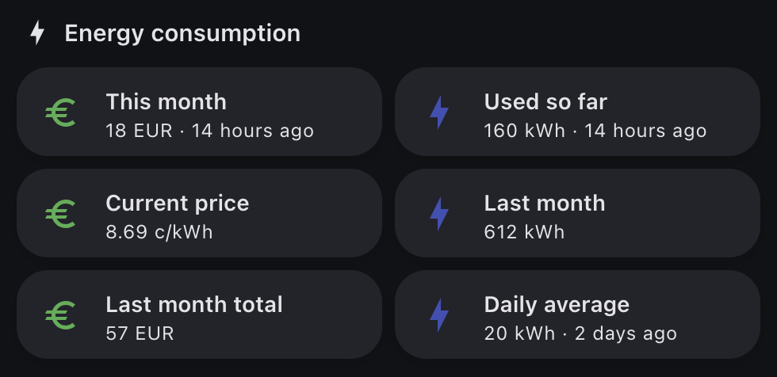

# Oma Helen Home Assistant integration  
[](https://github.com/hacs/integration)
[](https://github.com/carohauta/oma-helen-ha-integration/actions/workflows/test.yml)


[Home Assistant](https://www.home-assistant.io/) integration for [Oma Helen Python module](https://github.com/carohauta/oma-helen-cli). Periodically fetch your electricity consumption and estimated costs.

  
💡 Dashboard tip: I recommend using Tile cards for a nice, clean look like in the screenshot above.

The integration works with the following contract types:
- Exchange Electricity (=pörssisähkö) https://www.helen.fi/en/electricity/electricity-products-and-prices/exchange-electricity
- Market Price Electricity https://www.helen.fi/en/electricity/electricity-products-and-prices/marketpriceelectricity
- Fixed Price Electricity https://www.helen.fi/en/electricity/electricity-products-and-prices/fixed-price-basic-electricity

Requires HA Core version 2022.7.0 or newer

### How to install

The recommended way is to install via HACS

[](https://my.home-assistant.io/redirect/hacs_repository/?owner=carohauta&repository=oma-helen-ha-integration)

Then restart HA and add the `Helen Energy Price` integration via the UI in `Settings > Devices & Services > Add integration` and fill out the config form. Notice that you may now add even more entries directly from the UI in the integration settings!

### How to install manually

This is not the recommended way.

Login to your HA with SSH

1. Go to the HA configuration root folder, which is the same folder where your `configuration.yaml` is located. Run the following commands
```shell
cd custom_components # create this folder if it does not exist
git clone https://github.com/carohauta/oma-helen-ha-integration.git helen_energy_temp
mv helen_energy_temp/custom_components/helen_energy/ .
rm -rf helen_energy_temp
```
2. Restart HA
3. Add the `Helen Energy Price` integration via the UI in `Settings > Devices & Services > Add integration` and fill out the config form. Notice that you may now add even more entries directly from the UI in the integration settings!

### Migration from legacy configuration to the new UI config flow

Follow either of the install steps above. Your old entities will be automatically migrated and historical data retained as you add your first entry. **Remove any obsolete legacy yaml config related to this integration afterwards.**

### How to interpret the entities

Depending on your contract type you will see one of the following new entities:
- sensor.helen_exchange_electricity
- sensor.helen_market_price_electricity
- sensor.helen_fixed_price_electricity

**Multiple Entries**: If you have multiple Helen Energy Price entries configured, additional entries will have numbered suffixes (e.g., `sensor.helen_fixed_price_electricity_2`, `sensor.helen_monthly_consumption_3`).

The `state` of each entity is the total energy cost of the ongoing month. In the state attributes you may find some other useful information like last month's and current month's energy consumptions, daily average consumption, current electricity price (in fixed contracts) etc. Use template sensors to display the attributes.

If you have chosen to include the transfer costs you will also see the following entity:
- sensor.helen_transfer_costs

The `state` of the entity shows the total energy transfer costs for the ongoing month. The price is presented in EUR and it includes the base price of your transfer contract. If Helen is not your energy transfer company, this entity does not serve a purpose and shows a default value of `0.0`.

The integration also supports HA energy dashboard via the following entity:
- sensor.helen_monthly_consumption

The `state` of the sensor is the total energy consumption (in kWh) of the ongoing month.

### Examples

Template sensor configuration examples. Use these template sensors if you wish to extract additional data from each sensor entity's attributes (unit price, daily average consumption etc.)

**Note**: If you have added multiple Helen Energy Price entries, adjust the entity names in the templates below to match your specific entity names (e.g., `sensor.helen_fixed_price_electricity_2` for the second entry).

**Note**: There can only be one `template:` section in `configuration.yaml`. If you already have one, add the `- sensor:` block inside it without repeating the `template:` key.

#### Fixed Price Electricity

```yml
template:
  - sensor:
      - unique_id: helen_fixed_price_electricity_consumption
        name: helen_fixed_price_electricity_consumption
        unit_of_measurement: "kWh"
        device_class: energy
        icon: mdi:lightning-bolt
        state: >
          {{ 0 if state_attr('sensor.helen_fixed_price_electricity', 'current_month_consumption') == None else state_attr('sensor.helen_fixed_price_electricity', 'current_month_consumption') | round() }}
      - unique_id: helen_fixed_price_electricity_consumption_last_month
        name: helen_fixed_price_electricity_consumption_last_month
        unit_of_measurement: "kWh"
        icon: mdi:lightning-bolt
        state: >
          {{ 0 if state_attr('sensor.helen_fixed_price_electricity', 'last_month_consumption') == None else state_attr('sensor.helen_fixed_price_electricity', 'last_month_consumption') | round() }}
      - unique_id: helen_fixed_price_electricity_unit_price
        name: helen_fixed_price_electricity_unit_price
        unit_of_measurement: "c/kWh"
        icon: mdi:currency-eur
        state: >
          {{ 0 if state_attr('sensor.helen_fixed_price_electricity', 'fixed_unit_price') == None else state_attr('sensor.helen_fixed_price_electricity', 'fixed_unit_price') | round(2) }}
      - unique_id: helen_fixed_price_electricity_daily_average_consumption
        name: helen_fixed_price_electricity_daily_average_consumption
        unit_of_measurement: "kWh"
        icon: mdi:lightning-bolt
        state: >
          {{ 0 if state_attr('sensor.helen_fixed_price_electricity', 'daily_average_consumption') == None else state_attr('sensor.helen_fixed_price_electricity', 'daily_average_consumption') | round() }}
      - unique_id: helen_fixed_price_electricity_total_cost_last_month
        name: helen_fixed_price_electricity_total_cost_last_month
        unit_of_measurement: "EUR"
        icon: mdi:currency-eur
        state: >
          {{ 0 if state_attr('sensor.helen_fixed_price_electricity', 'last_month_consumption') == None else (state_attr('sensor.helen_fixed_price_electricity', 'last_month_consumption') * state_attr('sensor.helen_fixed_price_electricity', 'fixed_unit_price') / 100 + state_attr('sensor.helen_fixed_price_electricity', 'contract_base_price')) | round() }}
```

#### Exchange Electricity

```yml
template:
  - sensor:
      - unique_id: helen_exchange_energy_consumption
        name: helen_exchange_energy_consumption
        unit_of_measurement: "kWh"
        device_class: energy
        icon: mdi:lightning-bolt
        state: >
          {{ 0 if state_attr('sensor.helen_exchange_electricity', 'current_month_consumption') == None else state_attr('sensor.helen_exchange_electricity', 'current_month_consumption') | round() }}
      - unique_id: helen_exchange_energy_consumption_last_month
        name: helen_exchange_energy_consumption_last_month
        unit_of_measurement: "kWh"
        icon: mdi:lightning-bolt
        state: >
          {{ 0 if state_attr('sensor.helen_exchange_electricity', 'last_month_consumption') == None else state_attr('sensor.helen_exchange_electricity', 'last_month_consumption') | round() }}
      - unique_id: helen_exchange_energy_last_month_total_cost
        name: helen_exchange_energy_last_month_total_cost
        unit_of_measurement: "EUR"
        icon: mdi:currency-eur
        state: >
          {{ 0 if state_attr('sensor.helen_exchange_electricity', 'last_month_total_cost') == None else state_attr('sensor.helen_exchange_electricity', 'last_month_total_cost') | round() }}
      - unique_id: helen_exchange_energy_daily_average_consumption
        name: helen_exchange_energy_daily_average_consumption
        unit_of_measurement: "kWh"
        icon: mdi:lightning-bolt
        state: >
          {{ 0 if state_attr('sensor.helen_exchange_electricity', 'daily_average_consumption') == None else state_attr('sensor.helen_exchange_electricity', 'daily_average_consumption') | round() }}
```

#### Market Price

```yml
template:
  - sensor:
      - unique_id: helen_market_price_energy_consumption
        name: helen_market_price_energy_consumption
        unit_of_measurement: "kWh"
        device_class: energy
        icon: mdi:lightning-bolt
        state: >
          {{ 0 if state_attr('sensor.helen_market_price_electricity', 'current_month_consumption') == None else state_attr('sensor.helen_market_price_electricity', 'current_month_consumption') | round() }}
      - unique_id: helen_market_price_energy_consumption_last_month
        name: helen_market_price_energy_consumption_last_month
        unit_of_measurement: "kWh"
        icon: mdi:lightning-bolt
        state: >
          {{ 0 if state_attr('sensor.helen_market_price_electricity', 'last_month_consumption') == None else state_attr('sensor.helen_market_price_electricity', 'last_month_consumption') | round() }}
      - unique_id: helen_market_price_energy_last_month_total_cost
        name: helen_market_price_energy_last_month_total_cost
        unit_of_measurement: "EUR"
        icon: mdi:currency-eur
        state: >
          {{ 0 if state_attr('sensor.helen_market_price_electricity', 'last_month_total_cost') == None else state_attr('sensor.helen_market_price_electricity', 'last_month_total_cost') | round() }}
      - unique_id: helen_market_price_energy_daily_average_consumption
        name: helen_market_price_energy_daily_average_consumption
        unit_of_measurement: "kWh"
        icon: mdi:lightning-bolt
        state: >
          {{ 0 if state_attr('sensor.helen_market_price_electricity', 'daily_average_consumption') == None else state_attr('sensor.helen_market_price_electricity', 'daily_average_consumption') | round() }}
      - unique_id: helen_market_price_energy_price_current_month
        name: helen_market_price_energy_price_current_month
        unit_of_measurement: "c/kWh"
        icon: mdi:currency-eur
        state: >
          {{ 0 if state_attr('sensor.helen_market_price_electricity', 'price_current_month') == None else state_attr('sensor.helen_market_price_electricity', 'price_current_month') | round(2) }}
```
